# 从零开始构建一个React应用 [React](https://react.dev/) 文档;

## 步骤1 :安装构建工具;

用的是vite现在;

> npm create vite@latest my-app -- --template react-ts

项目的入口 : main.tsx ;

# 什么是JSX:

## 概念:

jsx是JavaScript和XML(HTML)的缩写,表示在js代码中编写HTML模板结构,它是React中编写UI模板的方式;

## 优势:

1. HTML的声明式模板写法;
2. JS的可编程能力;

## JSX的本质:

JSX 并不是标准的 JS 语法，它是 JS 的语法扩展，浏览器本身不能识别，需要通过解析工具做解析之后才能在浏览器中运行

**BABEL  -- 解析工具 [Babel](https://babeljs.io/repl#?config_lz=N4IgZglgNgpgdgQwLYxALhAJxgBygOgCsBnADxABoQdtiYAXY9AbWZHgDdLR6FMBzBkwwATGGAQBXKIwoACOAHt6ciDDkBGDfKUq1AfSSKARpo2UQRkdJjCJUOlWOT-kUrfT1MkmAF8AuhRs2AgAxvTcWJJw9BAo6CBS9IpICLGhIAFBIMS8ggC0AEyRYqGKmGnlxABqMJjEEIpwCYUADIUAzPlaFjgQODBQEHAwAAqYijiKxAhQCQAWYQDWmf6BOYqSmKEwACoAngMJVjaZQA&code_lz=DwEwlgbgfAsAUAFwBZgM4AI3vBewD0OUQA&lineWrap=true&version=7.29.4)**

## JSX中使用JS表达式:

在JSX中可以通过大括号语法{}识别JavaScript中的表达式,比如常见的变量、函数调用、方法调用等等

### 1.使用引号传递字符串;

```jsx
  {/* 1.使用引号传递字符串 */}
  {'111'}
```

### 2.使用JavaScript变量:

```jsx
const count = 111;
function App(){
return(
{/* 2.使用JavaScript变量` */}
  {count}
)
} 
```

### 3.函数调用和方法调用:

```jsx
  {getName()} {getName().toUpperCase()}
```

### 4.使用JavaScript对象

```jsx
  {/* 4.使用js对象 */}
  <div style={{color:'red'}}>111</div>
```

注意:if语句、switch语句、变量声明属于语句,不是表达式,不能出现在{}中

## JSX中实现列表渲染:

> 语法:在JSX中可以使用原生JS中的map方法遍历渲染列表
>
> map方法 核心key-value 键值对;

`map()`是数组的高阶函数，用于遍历数组并对每个元素执行回调函数，最终返回一个由回调函数结果组成的新数组。其核心特点包括：

* **不修改原数组** ：始终返回新数组，符合函数式编程的不可变性原则。
* **链式调用支持** ：可与其他数组方法（如 `filter()`、`reduce()`）组合使用。
* **简洁的转换逻辑** ：避免手动编写循环，提升代码可读性。

> 所以说foreach 不可以 因为没有返回值;
>
> * `map 循环哪个结构`：指用 `map` 遍历数据数组（比如 `list`），循环处理每一项数据；
> * `return结构`：指 `map` 的回调函数里，必须 `return` 要渲染的单个列表项的 JSX 结构（比如 `<div>`、自定义组件等）。

```jsx
{ list.map( item => <li key ={item.id}> {item.name} </li> )}
```

> `<li></li>` 里面是循环的内容 为列表中的每一个name  key值为id;

key的作用:React框架内部使用 提升更新性能的

## jsx中实现条件渲染;

语法:在React中,可以通过逻辑与运算符&&、三元表达式(?:)实现基础的条件渲染

### 1.通过逻辑与来控制某个元素的显示和隐藏; [一个元素]

```jsx
const isShow = true;
function APP(){
return (
        {/* 1.通过逻辑与来控制某个元素的显示和隐藏; */}
     { isShow && <div> 我显示出来了</div>}
)
}
```

### 2.三元运算符 来实现两个元素的分支切换显示;[两个元素]

> {isShow ? `<div>`我显示出来了 `</div>`: `<div>`我被隐藏了 `</div>`}

## JSX中实现复杂条件渲染;

需求:列表中需要根据文章状态适配三种情况,单图,三图,和无图三种模式


解决方案:自定义函数+if判断语句

# React 基础事件绑定;

## React 基础事件绑定;

语法: **on+事件名称={事件处理程序}**,整体上遵循驼峰峰命名法

```jsx
function HandleClick(){  
    alert("Button Clicked");
}   
function APP(){
    return(
        <div>
    <button onClick={HandleClick}>点击我</button>
        </div>

    )
}
export default APP;
```

我发现react里面onClick里面那个函数没有加括号 这个是因为 react JSX就是纯的JavaScript;

* **不加 `()`** ：传递函数本身，等待事件触发时才调用 ✅
* **加 `()`** ：立即执行函数，把返回值传给 onClick ❌

## 使用事件对象参数

语法:在事件回调函数中设置形参e

```jsx
     function HandleMouseOver(e){
        console.log("Mouse Over",e);
     }
```

然后一样调用;

## 传递自定义参数;

语法:事件绑定的位置改造成箭头函数的写法,在执行clickHandler实际处理业务函数的时候传递实参

```jsx
 function APP(){
    function ClickHandle(name){
        console.log("Button Clicked",name);
     }
     return(
    <button onClick = {()=>ClickHandle('我是中国人,我是React开发者')}>传递参数</button>
    )
}
export default APP;
```

注意:不能直接写函数调用,这里事件绑定需要一个函数引用

## 同时传透事件对象和自定义参数;

语法:在事件绑定的位置传递事件实参e和自定义参数,clickhHandler中声明形参,注意顺序对应

> <buttononClick = {(e)=>ClickHandle1('我是中国人',e)}>同时传透事件对象和自定义参数 `</button>`

# React中的组件;

## 组件是什么:

**概念:**一个组件就是用户界面的一部分,它可以有自己的为逻辑和外观,组件之间可以互相嵌套,也可以复用多次

## React组件:

在React中,一个组件就是首字母大写的函数,内部存放了组件的逻辑和视图UI,渲染组件只需要把组件当成标签书写即可

### 1.定义组件:

> function Button( ) {
>
> //组件内部逻辑
>
> return `<button>click me </button>`
>
> }

### 2.使用组件:

> function APP(){
>
> return
>
> <div>
>
> `<Button/>   或者 <Button></Button>`
>
> `</div>`
>
> }

! React 组件是常规的 JavaScript 函数，但  **组件的名称必须以大写字母开头** ，否则它们将无法运行！

! 组件可以渲染其他组件，但是  **请不要嵌套他们的定义** ：    组件嵌套组件 会非常慢 而且有可能出现bug;

# useState基础使用:

useState是一个React Hook(函数),它允许我们向组件添加一个状态变量,从而控制影响组件的渲染结果

本质:和普通JS变量不同的是,状态变量一旦发生变化组件的视图UI也会跟着变化(数据驱动视图)

`useState` 返回一个由两个值组成的数组：

1. 当前的 state。在首次渲染时，它将与你传递的 `initialState` 相匹配。
2. [`set` 函数](https://zh-hans.react.dev/reference/react/useState#setstate)，它可以让你将 state 更新为不同的值并触发重新渲染。

`useState` 返回的 `set` 函数允许你将 state 更新为不同的值并触发重新渲染。你可以直接传递新状态，也可以传递一个根据先前状态来计算新状态的函数

## 修改状态的规则:

### 状态不可变;

在React中,状态被认为是只读的,我们应该始终替换它而不是修改它,直接修改状态不能引发视图更新

> 调用 `set` 函数  **不能改变运行中代码的状态** ：
>
> 直接写 count++ 是没有效果的;

### 修改对象状态;

规则:对于对象类型的状态变量,应该始终传给set方法一个全新的对象来进行修改

`useState`需要依附 **当前正在渲染的函数组件执行环境** ，React 依靠渲染时的代码执行顺序来保存、匹配状态，脱离函数组件就没有对应的组件实例上下文，所以必须写在函数组件顶层作用域。

> 自定义 Hook 只是代码封装，`useState`执行环境依旧是 **父组件渲染时** ，占用当前组件 hooks 链表下标。

# 组件基础样式方案:

React组件基础的样式控制有俩种方式:

## 1.行内样式;

> <div style = {{ color:'red'}}>this is div `</div>`

## 2.class类名控制;

> .app{...}
>
> import './index.css;
>
> 使用时用的是className属性;
>
> `<span className='app'> 111</span>`

# 案例-B站评论案例;

## 1.渲染评论列表:

核心思路:
1.使用useState维护评论列表
2.使用map方法对列表数据进行遍历渲染(别忘了加key)

## 2.删除评论实现:

需求:
1.只有自己的评论才显示删除按钮
2.点击删除按钮,删除当前评论,列表中不再显示需求:

> **核心思路**
> 1.删除显示-条件渲染
> 2.删除功能-拿到当前项id以id为条件对评论列表做filter过滤

> onClick={() => setContent(content.filter(i => i.rpid !== item.rpid))}
>
> * **onClick** ：绑定点击事件
> * **setContent** ：修改列表状态
> * **filter** ：筛选数组，生成新数组
> * **i.rpid !== item.rpid** ：剔除当前点击项
> * **功能** ：点击删除列表对应条目

## 3.渲染导航Tab和高亮实现:

> **需求:**
> 点击哪个tab项,哪个做高亮处理
> **核心思路:**
> 点击谁就把谁的type(独一无二的标识)记录下来,然后和遍历时的每一项的type做匹配,谁匹配到就设置负责高亮的类名

## 4.评论列表排序功能实现;

> 需求:
> 点击最新,评论列表按照创建时间倒序排列(新的在前),,点击最热按照点赞数排序(多的在前)

核心思路:
把评论列表状态数据进行不同的排序处理,当成新值传给set函数重新渲染视图UI

# lodash

**1. 简化数据处理**

> 处理数组、对象、字符串、数字等，比如去重、排序、过滤、合并对象、深拷贝，用 Lodash 一行代码就能搞定，不用自己写复杂的循环和判断。

**2. 提供兼容性**

> 不同浏览器 / Node.js 版本对某些 JS 特性支持不一致，Lodash 帮你抹平这些差异，让代码在各种环境里都能稳定运行。

**3.提高开发效率**

> 它有上百个常用函数，都是经过优化的，不用你自己从零写工具函数，比如防抖、节流、类型判断、数据分组等。

# react中图片导入:

> react中 相对路径写法通常无法正确加载图片;
>
> **直接在 `src` 属性中使用字符串相对路径**
>
> ``  // ❌ 不生效

## React 中相对路径的规则：

### 1.图片放在 src 目录下,使用 import 导入;

```jsx
import avatarImg from './assets/avatar.jpg';  // 相对路径

```

### 2.图片放在 public 目录下路径:

```jsx
  // 相对于 public
```

## 3.require 导入:

```jsx
// 直接使用


// 动态路径
const imgName = 'avatar';

```

## **4.使用 URL 构造函数:**

```jsx
import avatarUrl from './assets/avatar.jpg?url';

```

## 5.批量导入（导入整个文件夹）:

```jsx
// 创建 images/index.js
const images = {
  avatar: require('./avatar.jpg'),
  logo: require('./logo.png'),
  bg: require('./bg.jpg'),
};
export default images;

// 使用
import images from './images';

```

## 6.动态导入(懒加载):

```jsx
import { useState, useEffect } from 'react';

function DynamicImage() {
  const [imgSrc, setImgSrc] = useState('');
  
  useEffect(() => {
    import('./assets/avatar.jpg').then(module => {
      setImgSrc(module.default);
    });
  }, []);
  
  return ;
}
```

## 7.svg特殊处理:

```jsx
// 作为 React 组件导入
import { ReactComponent as Logo } from './logo.svg';
<Logo />

// 作为 URL 导入
import logoUrl from './logo.svg';

```

# classnames优化类名控制:   它是js库 ;

> [classnames - npm](https://www.npmjs.com/package/classnames)

classnames是一个简单的JS库，可以非常方便的 通过条件动态控制class类名的显示

```jsx
function APP ( ){
 return(
<div>
<span 
   key = {item.type }
   onClick={ ()=> handleTabChange(item.type)}
   className={ `nav-item ${type === item.type && 'active'}`}>
   {item.text}
</span>
</div>
)
}   //问题: 字符串的拼接方式不够直观,也容易出错;
```

改:

> classNaame={className('nav-item',{active:type === item.type } ) }

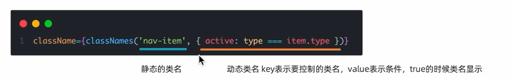

# 受控表单绑定:

> 概念:使用React组件的状态(useState)控制表单的状态,

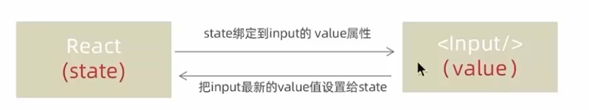

## 1.React状态值;

> const [value,setValue] = useState('')

2.通过value属性绑定状态,通过onChange属性绑定状态同步的函数;

```jsx
<input
  type="text"
  value=[value]
  onChange={?(e) =>setValue(e.target.value)}
```

# React中获取DOM;

在React组件中获取/操作DOM,需要使用useRef钩子函数,分为两步:

## 1.使用useRef创建ref对象,并与JSX绑定;

```jsx
const inputRef = useRef(null)

<input type="text" ref={inputRef}/>
```

## 2.在DOM可用时,通过inputRef.current拿到DOM对象;

> console.log(inputRef.current)

# B站评论案例-id处理和时间处理:

> 1.rpid要求一个唯一的随机数id-uuid
> 2.ctime要求以当前时间为标准,生成固定格式-dayjs

在学vue的时候就已经用过了;

> **下载**
>
> npm install uuid
>
> 使用:
>
> ```
> import { v4 as uuidv4 } from "uuid";
>
> uuidv4(); // ⇨ 'ab16e731-6cee-424d-81a0-5929e9bdb0cc'
> ```

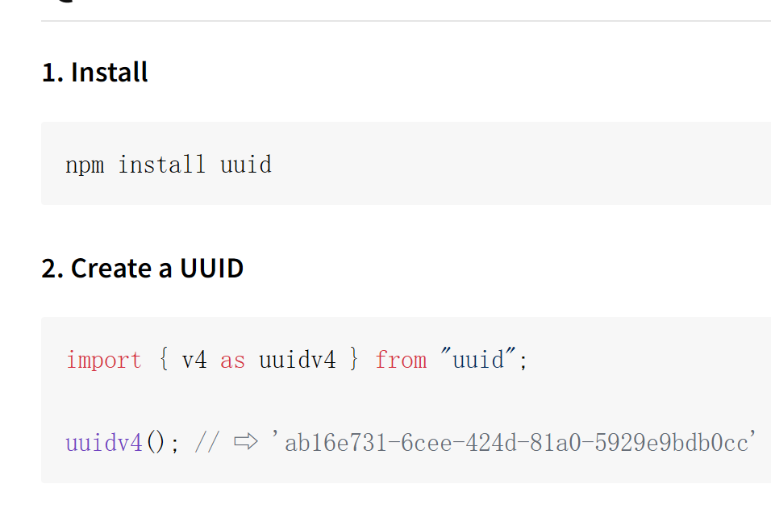

## 下载dayjs:

Day.js 是一个轻量的处理时间和日期的 JavaScript 库，和 Moment.js 的 API 设计保持完全一样。

```
npm install dayjs --save
```

# B站评论案例 -- 清空内容并重新聚焦;

> 1.清空内容-把控制input框的value状态设置为空串
>
> setcontent('')
> 2.重新聚焦-拿到input的dom元素,调用focus方法
>
> focus()

# 组件通信;

**理解组件通信**
概念:组件通信就是组件之间的数据传递,根据组件嵌套关系的不同,有不同的通信方法

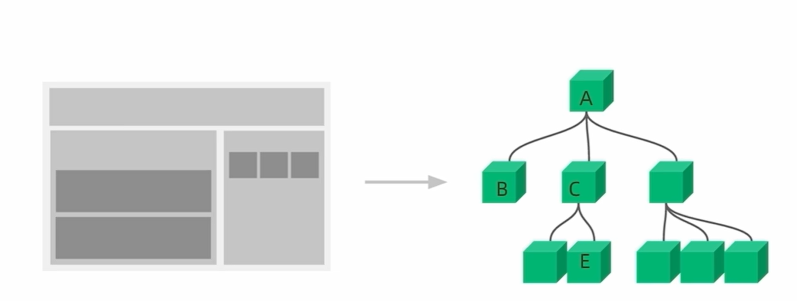

A-B 父子通信
B-C兄弟通信
A-E跨层通信

## 父传子-基础实现;

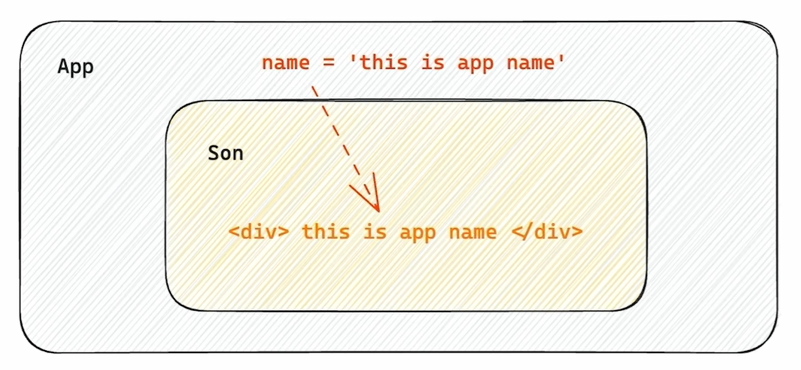

> ***实现步骤:***

1.父组件传递数据-在子组件标签上绑定属性

2.子组件接收数据-子组件通过props参数接收数据

```jsx
// 父传子
function Son(props){
    return (
        <>
        <div>{props.name}</div>
        <div>this is son</div>

        <div>{props.children}</div>  
        {/* 传过去的直接就是 <div>this is children</div> */}
        </>
    )
}
//  ## 父传子-基础实现;
function APP(){
    const name = 'this is app'
    return (
        <>
        <Son name={name}/> 
        {/* 父传子 - 特殊的prop children; */}
        <Son>
            <div>this is children</div>
        </Son>
        </>
    )
}
 
export default APP;
```

### 父传子-props说明

1. props可传递任意的数据
   数字、字符串、布尔值、数组、对象、函数、JSX
2. props是只读对象;
   子组件只能读取props中的数据,不能直接进行修改,父组件的数据只能由父组件修改; --谁的数据谁进行修改;

### 父传子 - 特殊的prop children;

场景:当我们把内容嵌套在子组件标签中时,父组件会自动动在名为children的prop属性中接收该内容

我们可以在子组件中直接嵌套内容 像这样:

```jsx
<Son>
  <span> this is span </span>
</Son>
```

这个的话就相当于 children属性;

> props
>
> children:`<span/>`
>
> new entry:""

## 父子组件通信 -- 子传父;

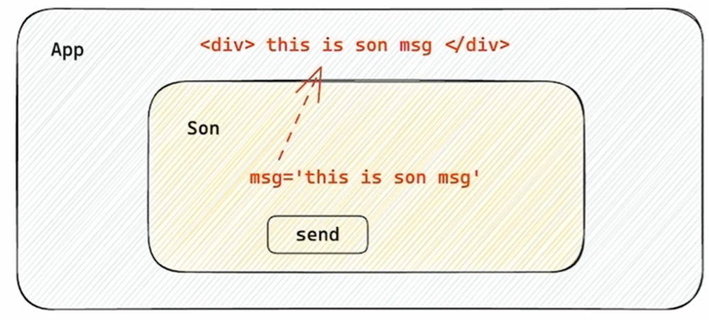

核心思路: 在子组件中调用父组件中的函数并传递参数;

```jsx
function APP (){
const getMsg = (msg) => console.log(msg)
return (
<div>
  <Son onGetMsg = {getMsg} />
</div>
)
}

   function Son ({onGetMsg}){
   const sonMsg = 'this is son msg'
   return(
   <div>
   <button onClick = {()=> onGetMsg(sonMsg)}>send</button>
   </div>   
)
}
```

 在子组件中调用父组件中的函数并传递实参;

## 使用状态提升实现兄弟组件通信;

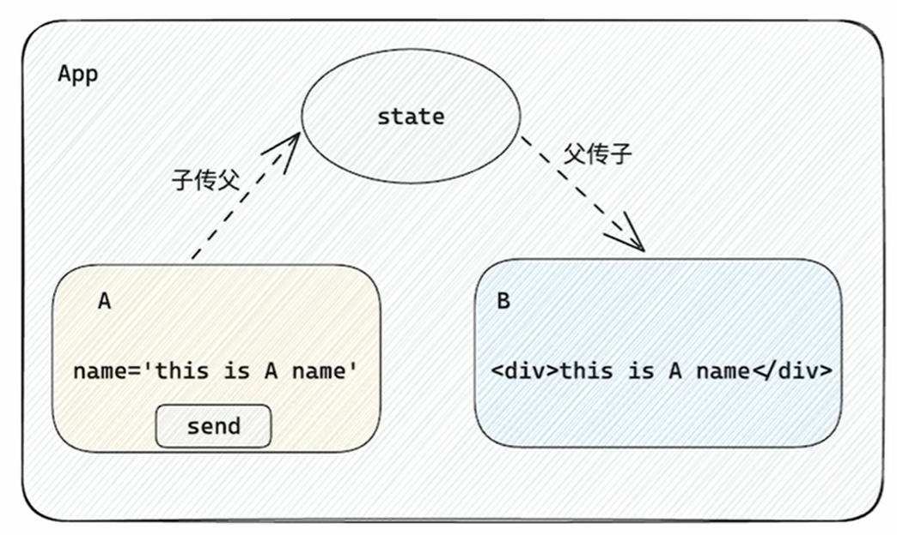

实现思路:借助"状态提升"机制,通过父组件进行兄弟组件之间的数据传递

> 1.通过子传父 A-> APP;
>
> 2.通过父传子 APP -> B;

## 使用Context机制跨层级组件通信;

> 实现步骤:
> 1.使用createContext方法创建一个上下文对象Ctx
> 2.在顶层组件(App)中通过Ctx.Provider组件提供数据
> 3.在底层组件(B)中通过useContext钩子函数获取消费数据


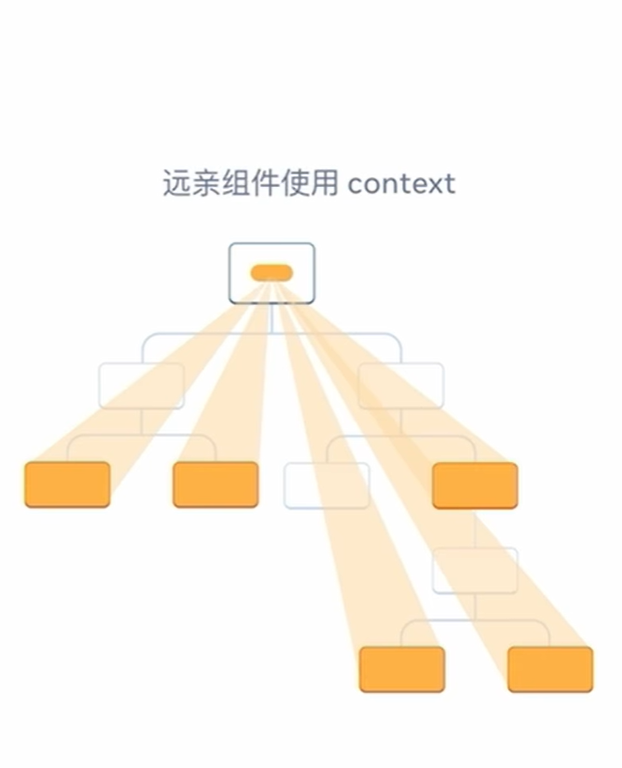

底层是相对的 只要形成了这种嵌套关系 那么就可以使用这套机制;

```jsx
// app嵌套a A嵌套B
import { createContext ,useContext} from 'react';

const SomeContext = createContext()
function APP(){
    const msg = 'this is app'
    return(
   <SomeContext.Provider value={msg}>
   <div>我是APP</div>
        <A />
        </SomeContext.Provider>
    )
}

function A(){
   return(
    <>
    <B />
    <div>this is A</div>
    </>
   )
}

function B(){
   const msg= useContext(SomeContext)
    return(
        <>
        <div>this is B   {msg}</div>
        </>
    )
}
export default APP;
```

# useEffect的概念理解

useEffect是一个React Hook函数,用于在React组件中创建不是由事件引起而是由渲染本身引起的操作,比如发送AJAX请求,更改DOM等等

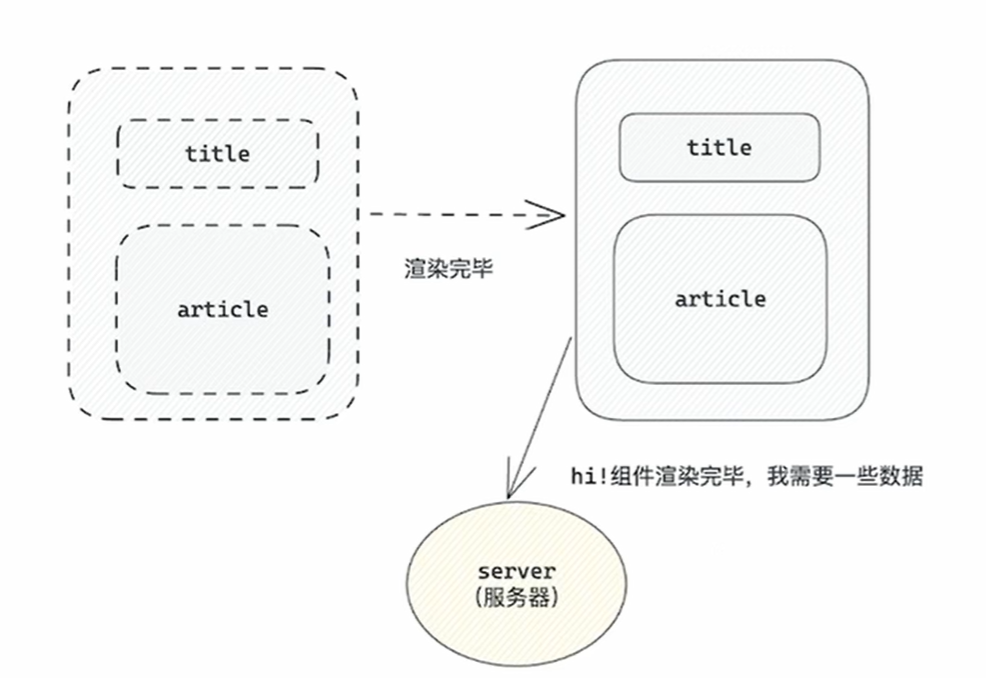

上面的组件中没有发生任何的用户事件,***组件渲染完毕之后就需要和服务器要数据,***整个过程属于"只由渲染引起的操作";   --- 整个过程没有任何参与;

## 语法:

> useEffect(()=> { }, [])
>
> 参数1是一个函数,可以把它叫做副作用函数,在函数内部可可以放置要执行的操作
> 参数2是一个数组(可选参),在数组里放置依赖项,不同依赖项会影响第一个参数函数的执行,当是一个空数组的时候,副作用函数只会在组件渲染完毕之后执行一次

## 与vue3相比:

> # useEffect vs Vue3(onMounted/watch/onUnmounted)区别｜精简笔记
>
> ## 1、API结构不同
>
> **React useEffect：单API统一管理挂载+更新+卸载**
>
> ```js
> useEffect(()=>{
>   // 挂载/数据更新执行
>   return ()=>{
> /*卸载清理*/} // 同代码块写销毁
> },[依赖])
> ```
>
> **Vue3：拆分3个独立API**
>
> ```js
> onMounted(()=>{}) //挂载
> watch(变量,()=>{}) //变量更新
> onUnmounted(()=>{}) //卸载清理
> ```
>
> 创建、清理代码**被拆分两处**。
>
> ## 2、依赖收集：显式 vs 自动隐式
>
> - **useEffect：手动写依赖数组 []，用到什么就写入，ESLint自动校验缺失**，依赖一目了然
> - **Vue(watch/watchEffect)：Proxy自动收集依赖，不用手动罗列；隐性追踪，容易意外触发执行**
>
> ## 3、执行时机靠依赖控制
>
> | 写法                  | React          | Vue等价             |
> | --------------------- | -------------- | ------------------- |
> | `useEffect(fn,[])`  | 仅挂载执行1次  | onMounted           |
> | `useEffect(fn,[a])` | a变化就执行    | watch(a)            |
> | `useEffect(fn)`     | 每次渲染都执行 | onMounted+onUpdated |
>
>> Vue需要切换不同钩子，React只改依赖数组即可
>>
>
> ## 4、副作用拆分
>
> - React：**多个useEffect分开写**，不同业务逻辑各自独立
> - Vue：初始化逻辑默认全堆在onMounted内部，多业务易臃肿
>
> ## 5、清理逻辑
>
> - React：**return函数统一清理**（定时器、取消请求、解绑事件），和业务代码放一起
> - Vue：清理必须写到单独 `onUnmounted`，容易遗漏销毁代码
>
> ## 一句话总结
>
> **useEffect：一个API、一处代码、显式依赖；Vue：多钩子分散、自动依赖、清理分开写**。

## useEffect依赖项参数说明

useEffect副作用函数的执行时机存在多种情况,根据传入依赖项的不同,会有不同的执行表现

| 依赖项         | 副作用函数执行时机                |
| -------------- | --------------------------------- |
| 没有依赖项     | 组件初始渲染+组件更新时执行       |
| 空数组依赖     | 只在初始渲染时执行一次            |
| 添加特定依赖项 | 组件初始渲染+特性依赖项变化时执行 |

## useEffect -- 清除副作用

在useEffect中编写的**由渲染本身引起的对接组件外部的操作**,社区也经常把它叫做***副作用操作***,比如在useEffect中开启了一个定时器,我们想在组件卸载时把这个定时器再清理掉,这个过程就是清理副作用

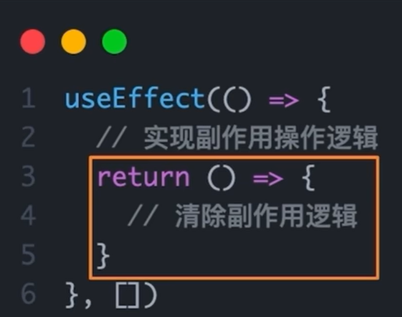

说明:清除副作用的函数最常见的执行时机是在组件卸载时自动执行

需求:在Son组件渲染时开启一个定制器,卸载时清除这个定时器;

```jsx
useEffect(()=>{
//实现副作用操作逻辑;
return ()=>{
//清除副作用逻辑;
}
})
```

# 自定义HOOK函数;

概念:自定义Hook是以use打头的函数,通过自定义Hook函数可以用来实现逻辑的封装和复用

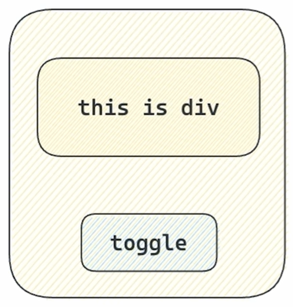点击toggle 来控制盒子是否显示;

// 1.声明一个以use打头的函数

// 2.在函数体内封装可复用的逻辑(只要是可复用的逻辑)

// 3.把组件中用到的状态或者回调return出去(以对象或者数组

// 4.在哪个组件中要用到这个逻辑,就执行这个函数,解构出来状态和回调进行使用

```jsx
import { useState } from 'react'
function isShow () {
     const [show,setShow] = useState(true)
   
     const toggle = () => setShow(!show)

     return {
        show,
        toggle
     }
}
function APP(){
    const { show,toggle } = isShow()

    return (
        <>
        {/* 自定义函数实现点击按钮控制框 */}
      {show &&  <div style={ boxStyle}> this is div </div>}
        <button onClick={toggle}>toggle</button>
        </>
    )
}
export default APP;
```

## React Hooks 使用规则:

### 使用规则:

1.只能在组件中或者其他自定义Hook函数中调用
2.只能在组件的顶层调用,不能嵌套在if、for、其他函数中

# 优化需求 -- 通过接口获取评论列表 (B站)

1.使用json-server工具模拟接口服务，通过axios发送接口请求json-server是一个快速以。json文件作为数据源模拟接口服务的工具axios是一个广泛使用的前端请求库;

> ```
> npm install json-server
> ```

2.使用useEffect调用接口获取数据;

# 优化需求-封装评论项ltem组件:

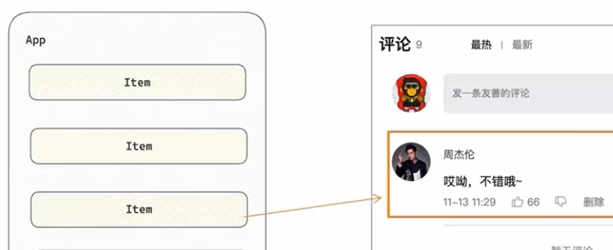

抽象原则:App作为"智能组件"负责数据的获取,Item作为"UI组件"负责数据的渲染

# 什么是Redux?

Redux 是React最常用的 ***集中状态管理工具,***类似于Vue中的Pinia(Vuex),***可以独立于框架运行;***

作用:通过集中管理的方式管理应用的状态

不和任何框架绑定,不使用任何构建工具,使用纯Redux实现计数器


使用步骤:

1. 定义一个 **reducer 函数** (根据当前想要做的修改返回一个新的状态)
2. 使用 createStore 方法传入 reducer 函数生成一个 **store 实例对缘**
3. 使用 store 实例的 **subscribe 方法**订阅数据的变化 (数据一旦变化，可以得到通知)
4. 使用 store 实例的 **dispatch 方法提交 action 对象**触发数据变变化 (告诉 reducer 你想怎么改数据)
5. 使用 store 实例的 **getState 方法**获取最新的状态数据更新到视图中

## Redux管理数据流程梳理:

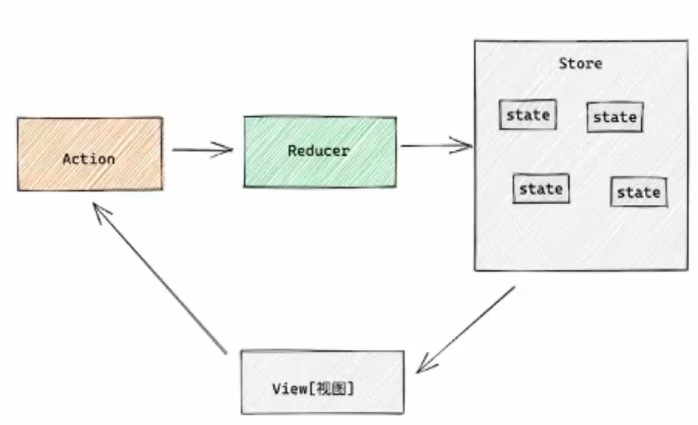

为了职责清晰,数据流向明确,Redux把整个数据修改的流程分分成了三个核心概念,分别是:state、action和reducer
1.state-一个对象存放着我们管理的数据状态
2.action-一个对象用来描述你想怎么改数据
3.reducer-一个函数更具action的描述生成一个新的state

## Redux与React -- 环境准备;

### 配套工具:

在 React 中使用 redux, 官方要求安装俩个其他插件 - ***Reedux Toolkit*** 和 ***react-redux***

1. Redux Toolkit (RTK)- 官方推荐编写 Redux 逻辑的方式，是一套工具的集合集，**简化书写方式**

简化 store 的配置方式                       内置immer支持可变式状态修改                                      内置 thunk 更好的异步创建

2. react-redux - 用来链接 Redux 和 React 组件的中间件

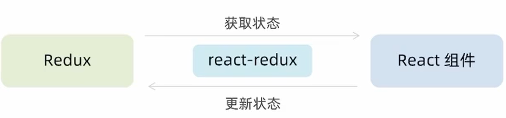

    ----获取状态----->

Redux           react-redux                  React 组件

    <----更新状态-----

### 配置基础环境:

1.使用 CRA 快速创建 React 项目

npx create-react-app react-redux

2.安装配套工具

npm i @reduxjs/toolkit react-redux

3.启动项目

npm run start

### 使用: store目录结构设计;

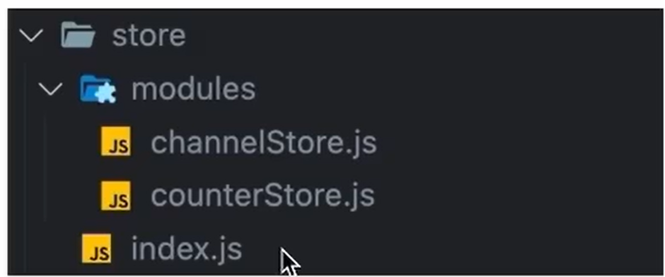

1. 通常集中状态管理的部分都会单独创建一个单独的 `store目录 `
2. `应用通常会有很多个子store模块,所以创建一个`modules` 目录，在内部编写业务分类的子 store
3. store 中的入口文件 index.js 的作用是组合 modules 中所有的子模块，并导出 store

## Redux与React -- 实现counter

### 整体路径熟悉

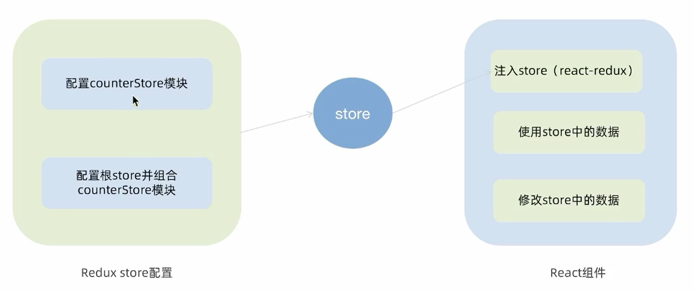

### 使用React Toolkit创建counterStore:

counterStore.js

```js
import { createSlice } from '@reduxjs/toolkit'

const initialState = { value: 0 }

const counterStore = createSlice({
  name: 'counter',
  //初始化 state ;
  initialState,
  //修改状态的方法 同步方法 支持直接修改;
  reducers: {
    increment(state) {
      state.value++
    },
    decrement(state) {
      state.value--
    },
    incrementByAmount(state, action) {
      state.value += action.payload
    },
  },
})
//解构出来actionCreater函数;
export const { increment, decrement, incrementByAmount } = counterStore.actions
//获取reducer
const counterReducer = counterStore.reducer
export default counterReducer
```

index.js

```js
import { configureStore } from "@reducjs/toolkit"
import counterReducer from "./modules/counterReducer.js"

const store = configureStore({
    reducer:{
        counter:counterReducer
    }
})
export default store
```

### 为React注入store:

react-redux 负责把 Redux 和 React 链接起来，内置 Provider 组件通过 store 参数把创建好的 store 实例注入到应用中, 链接正式建立

```js
import store from './store'
import { Provider } from 'react-redux'
const root = ReactDom.createRoot(document.getElementById('root'))
root.render(
<Provider store={store}>
<APP/>
<Provider>
)
```

### React 组件修改 store 中的数据:

React 组件中修改 store 中的数据需要借助另外一个 hook 函数 - useDispatch, 它的作用是生成提交 action 对象的dispatch 函数，使用样例如下:

```jsx
       <button onClick={()=>{dispatch(increment())}}>  {count}     </button>
```

### Redux与React--提交action参数;

#### 需求说明:

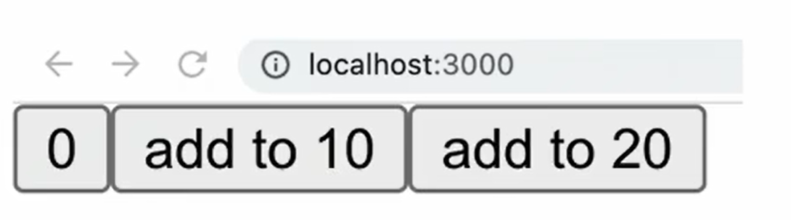

组件中有两个按钮'add to 10'和'add to 20'可以直接把count值修改到对应的数字,目标count值是在组件中传递过去的,需要在提交action的时候传递参数;

#### 提交 action 传参实现需求

在 reducers 的同步修改方法中添加 action 对象参数，在调用 actionCreater 的时候传递参数，参数会被传递到 actidn 对象 payload 属性上

## Redux与React -- 异步状态操作

1. 创建 store 的写法保持不变，配置好同步修改状态的方法
2. 单独封装一个函数，在函数内部 return 一个新函数，在新函数中

   2.1 封装异步请求获取数据

   2.2 调用同步***actionCreater* **传入异步数据生成一个 action 对象，并使用 dispatch 提交
3. 组件中 dispatch 的写法保持不变

## Redux调试 - - devtools;

1. React Developer Tools
2. Redux DevTools

# 美团外卖

## 美团外卖 -- 案例演示和环境准备;


功能列表:

商品列表和分类渲染

添加商品

购物车操作

订单数量统计和高亮实现

基本开发思路：使用 RTK (ReduxToolkit) 来管理应用状态，组件负责数据渲染和 dispatchaction

## 准备并熟悉环境:

1.克隆项目到本地

> git clone http://git.itcast.cn/heimaqianduan/redux-meituan.git

2.安装所有依赖

> npm i

3.启动mock服务(内置了json-server)

> npm run serve

## 实现步骤

启动项目（mock服务+前端服务）
使用RTK编写store（异步action）
组件触发action并且渲染数据

## 美团外卖-点击分类激活交互实现:

***Tab切换类交互***

> 记录当前点击项
> (activelndex)

> 动态控制激活类名
> (activelndex=== index)

### 步骤分析:

使用 RTK 编写管理 activelndex

组件中点击时触发 action 更改 activelndex

动态控制激活类名显示

## 美团外卖--商品列表切换显示;

条件渲染:控制对应项显示;

activeIndex === index && 视图

# JavaScript reduce 超清晰笔记（直接抄，好记好用）

## 一、reduce 是什么

**数组方法**，专门用来：**把数组里的所有元素，汇总/合并成 1 个最终结果**

- 求和、算总价、统计次数、数组扁平化、对象合并都用它
- 比 forEach 更简洁，不用额外定义外部变量

---

## 二、核心语法（死记这行）

```js
数组.reduce((累加器a, 当前项c) => {
  return 新的累加值
}, 初始值)
```

### 4 个关键

1. **a（累加器）**：上一轮算出来的结果（最重要）
2. **c（当前项）**：正在遍历的那一个元素
3. **return**：必须写！用来更新累加器
4. **初始值**：第一次循环时 a 的值（**必传，不传容易报错**）

---

## 三、最常用场景（背熟 3 个）

### 1. 购物车算总价（你正在用的）

```js
cartList.reduce((total, item) => {
  return total + item.price * item.count
}, 0)
```

- `total` = 累加的总价
- `item` = 单个商品
- `0` = 总价从 0 开始加

### 2. 普通数组求和

```js
[1,2,3,4].reduce((a,c)=>a+c, 0) // 结果 10
```

### 3. 统计元素出现次数

```js
['苹果','香蕉','苹果'].reduce((obj, item)=>{
  obj[item] = (obj[item]||0) + 1
  return obj
}, {})
// 结果：{苹果:2, 香蕉:1}
```

---

## 四、必背口诀

**reduce 干的事：遍历 → 累加 → 返回一个值**

- 求和给初始值 `0`
- 拼字符串给 `''`
- 统计/对象给 `{}`
- 扁平化数组给 `[]`

---

## 五、和 forEach 区别（一句话）

- forEach：要先定义变量，一步步加
- reduce：**一行直接出结果，更干净**

---

# ReactRouter: https://reactrouter.com

## 什么是前端路由:

一个路径 path 对应一个组件 component 当我们在浏览器中访问一个 path 的时候，path 对应的组件会在页面中进行渲染

## 创建路由开发环境

使用路由我们还是采用 CRA 创建项目的方式进行基础环境配置

1. 创建项目并安装所有依赖;
   > npx create-react-app react-router-pro  npm i
   >
2. 安装最新的ReactRouter包;
   > npm i react-router-dom
   >
3. 启动项目;
   > npm run start
   >

## 什么是路由导航

路由系统中的多个路由之间需要进行路由跳转，并且在跳转的同时有可能需要传递参数进行通信

### 声明式导航

声明式导航是指通过在模版中通过`````````<Link/>`````````` 组件描述出要跳转转到哪里去，比如后台管理系统的左侧菜单通常使用这种方式进行

`<Link to="/article">文章</Link>    https://reactrouter.com/start/framework/navigating`

语法说明：通过给组件的 ***to 属性指定要跳转到路由 path***, 组件会被渲染为浏览器支持的 a 链接，如果需要传参直接***通过字符串拼接的方式拼接***参数即可

link标签相当于a标签;

### 编程式导航

编程式导航是指通过 'useNavigate' 钩子得到导航方法，然后通过调用方法以命令式的形式进行路由跳转，比如想在登录请求完毕之后跳转就可以选择这种方式，更加灵活

```jsx
import { useNavigate } from "react-router-dom";

const Login: React.FC = () => {
  const navigate = useNavigate();

  return (
    <div>
      我是登录页
      <button onClick={() => navigate('/article')}>跳转至文章</button>
    </div>
  );
};

export default Login;
```

语法说明：通过调用 navigate 方法传入地址 path 实现跳转

## 路由导航传参:

### searchParams传参:

路由跳转;

> navigate('/article?id=1001&name=jack')

目标路由:来接受参数;

> const [params] = useSearchParams
>
> let id = params.get('id')

### params传参:

> navigate('/article/0001')

> const params = useParams()
>
> let id = params.id

路由配置文件中

> {
>
> path:'article/:id'
>
> }

## ReactRouter - 嵌套路由配置:

### 什么是嵌套路由

在一级路由中又内嵌了其他路由，这种关系就叫做嵌套路各由，嵌套至一级路由内的路由又称作二级路由，例如

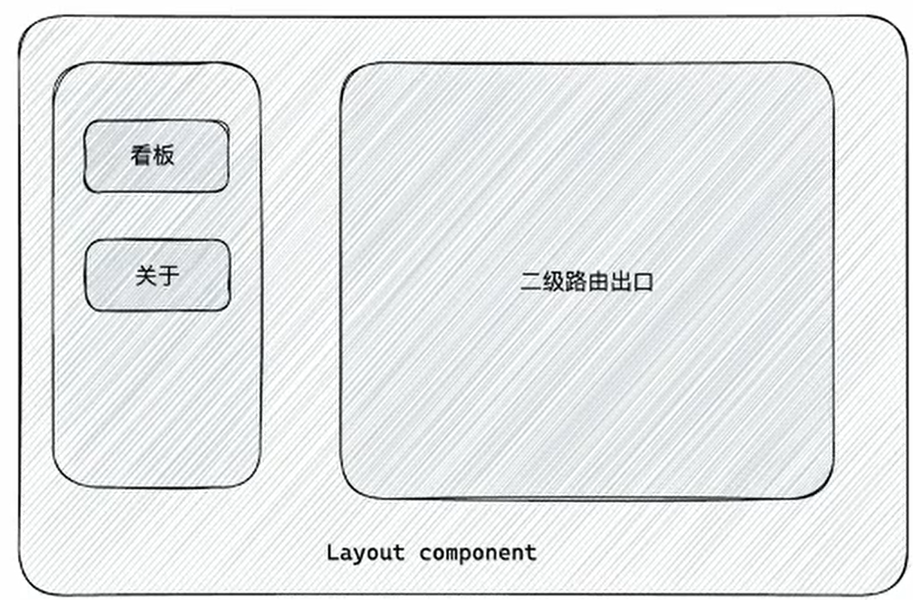

### 嵌套路由配置

实现步骤：
1.使用children属性配置路由嵌套关系
2.使用``````````````<Outlet/>`````````````组件配置二级路由渲染位置

### ReactRouter - 默认二级路由

场景和配置方式
当访问的是一级路由时，默认的二级路由组件可以得到渲染，只需要在二级路由的位置去掉path，设置index属性为true

## ReactRouter-404 路由配置

实现步骤:

1. 准备一个 NotFound 组件
2. 在路由表数组的末尾，以 * 号作为路由 path 配置路由

> {
>
> path:'*',
>
> element:`<NotFound/>`
>
> }

## ReactRouter - 俩种路由模式:

各个主流框架的路由常用的路由模式有俩种，history 模式和 hash 模式，ReactRouter 分别由 createBrowerRouter 和createHashRouter 函数负责创建

| 路由模式 | url表现     | 底层原理                   | 是否需要后端支持 |
| -------- | ----------- | -------------------------- | ---------------- |
| history  | url/login   | history对象+ pushState事件 | 需要             |
| hash     | url/#/login | 监听 hashChange事件        | 不需要           |

** hash 模式“不需要后端支持”，是因为它的路由变化完全发生在浏览器端，不会向服务器发起新的 HTTP 请求。**

# 实例-记账:

## 环境搭建

使用 CRA 创建项目，并安装必要依赖，包括下列基础包

1. Redux 状态管理 -@reduxjs/toolkit、react-redux
2. 路由 - react-router-dom
3. 时间处理 - dayjs
   4.class 类名处理 - classnames
4. 移动端组件库 - antd-mobile
5. 请求插件 - axios

## 别名路径配置:

1. 路径解析配置 (webpack), **把 @/ 解析为 src/**
2. 路径联想配置 (VsCode), **VsCode 在输入 @/ 时，自动联想出来对应的 src / 下的子级目录**

### 方案一：craco（适用于 Create React App---路径解析配置(webpack) -- craco插件;

路径解析配置

CRA 本身把 webpack 配置包装到了黑盒里无法直接修改，需要借助一个插件 - craco

#### 配置步骤:

#### 1. 安装依赖

```bash
npm install @craco/craco --save
# 或
yarn add @craco/craco
```

#### 2. 修改 `package.json` 中的 scripts

```json
"scripts": {
  "start": "craco start",
  "build": "craco build",
  "test": "craco test"
}
```

#### 3. 在项目根目录创建 `craco.config.js`

```javascript
const path = require('path');

module.exports = {
  webpack: {
    alias: {
      '@': path.resolve(__dirname, 'src'),
      // 如需更多别名，继续添加：
      // '@components': path.resolve(__dirname, 'src/components'),
      // '@hooks': path.resolve(__dirname, 'src/hooks'),
    },
  },
};
```

#### 4. 配置 TypeScript 路径识别（如使用 TS）

在 `tsconfig.json` 中添加：

```json
{
  "compilerOptions": {
    "baseUrl": ".",
    "paths": {
      "@/*": ["src/*"]
    }
  }
}
```

如果是 JavaScript 项目，则写在 `jsconfig.json` 中，内容相同。

---

### 方案二：Vite（适用于 Vite + React）

#### 1. 安装 Node.js 类型定义（TypeScript 项目需要）

```bash
npm install -D @types/node
```

#### 2. 在 `vite.config.ts` 中配置别名

```typescript
import { defineConfig } from 'vite';
import react from '@vitejs/plugin-react';
import path from 'path';

export default defineConfig({
  plugins: [react()],
  resolve: {
    alias: {
      '@': path.resolve(__dirname, './src'),
    },
  },
});
```

#### 3. 配置 TypeScript 路径识别

在 `tsconfig.json` 中添加：

```json
{
  "compilerOptions": {
    "baseUrl": ".",
    "paths": {
      "@/*": ["src/*"]
    }
  }
}
```

---

#### 使用示例

配置完成后，在组件中即可使用别名导入：

```javascript
// ❌ 之前（相对路径）
import Button from '../../../components/Button';
import { formatDate } from '../../../utils/date';

// ✅ 之后（别名路径）
import Button from '@/components/Button';
import { formatDate } from '@/utils/date';
```

---

### 路径联想配置(VsCode) -- jsconfig.json;

在 VS Code 中，通过 `jsconfig.json` 或 `tsconfig.json` 可以让编辑器识别路径别名，实现 **智能提示** 、**自动补全**和**跳转定义**功能。

#### 完整配置示例

在项目**根目录**创建 `jsconfig.json` 文件：

```
{
  "compilerOptions": {
    // 基准目录，用于解析 paths
    "baseUrl": ".",

    // 路径别名映射
    "paths": {
      // 将 '@/*' 映射到 'src/*'
      "@/*": ["src/*"],

      // 可以添加更多别名
      "@components/*": ["src/components/*"],
      "@utils/*": ["src/utils/*"],
      "@hooks/*": ["src/hooks/*"],
      "@assets/*": ["src/assets/*"],
      "@styles/*": ["src/styles/*"],
      "@api/*": ["src/api/*"],
      "@types/*": ["src/types/*"]
    },

    // 目标 JS 版本（可选）
    "target": "ESNext",

    // 模块解析策略（可选）
    "moduleResolution": "node",

    // 允许从 node_modules 解析（可选）
    "resolveJsonModule": true
  },

  // 指定包含的文件/目录
  "include": ["src/**/*"],

  // 排除的文件/目录
  "exclude": ["node_modules", "build", "dist", "coverage"]
}
```

---

#### 配置字段说明

| 字段                           | 说明                                           |
| ------------------------------ | ---------------------------------------------- |
| **`baseUrl`**          | 路径解析的基准目录，`"."` 表示项目根目录     |
| **`paths`**            | 路径别名映射，键为别名模式，值为实际路径数组   |
| **`include`**          | 指定哪些文件被项目包含，用于智能提示范围       |
| **`exclude`**          | 排除不需要解析的目录，提升性能                 |
| **`target`**           | 指定 ECMAScript 目标版本                       |
| **`moduleResolution`** | 模块解析策略，`"node"` 模拟 Node.js 解析方式 |

---

#### 配置后效果

配置完成后，在 VS Code 中导入文件时：

**javascript**

```
// 输入时触发智能提示
import Button from '@/components/Button';
//                    ↑ 输入 @/ 后会联想出 components、utils、hooks 等目录

import { formatDate } from '@/utils/date';
//                         ↑ 可跳转至 src/utils/date.js 文件

import useFetch from '@hooks/useFetch';
//                  ↑ 悬停显示类型信息（如有 JSDoc）
```

## Mock假数据;

1. 前端直接写假数据    ----    纯静态，没有服务
2. 自研 Mock 平台  ---  成本太高
3. ***json-server等工具 --- 有服务,成本低;***

### json-server 实现数据 Mock

json-server 是一个 node 包，可以在不到 30 秒内获得零编码的完整的 Mock 服务;

#### 实现步骤:

1. 项目中安装 json-server

> npm i -D json-server

2. 准备一个 json 文件
3. 添加启动命令

> "server":"json-server ./server/data.json --port 8888"

4. 访问接口进行测试

## 记账本 - 整体路由设计;

## 记账本 - antD-mobile 主题定制; https://mobile.ant.design/zh/guide/quick-start

**定制方案:**

1. 全局定制

> 整个应用范围内的组件都生效

2. 局部定制

> 只在某些元素内部的组件生效

实现方式:

1. 全局

```css
:root:root{
 --adm-color-primary:#a062d4;
}
```

2. 局部;
   > .purple-theme{ --adm-color-primary: #a062d4; }
   >

## 记账本 - Redux 管理账目列表;

### 基于 RTK 管理账目列表;

RTK                                                                                             component
state- billList                                                                           dispatch 异步action
reducer -setBillList
异步action

## 如果想同时启动mock数据可以在package.json文件中进行配置

```js
  "scripts": {
    "start": "craco start & npm run server",
 
    "server":"./server/data.json -port 8888"
  },
```

## 记账本 - TabBar 功能实现;

需求理解和实现方式
需求：使用antD的TabBar标签栏组件进行布局以及路由的切换


111
